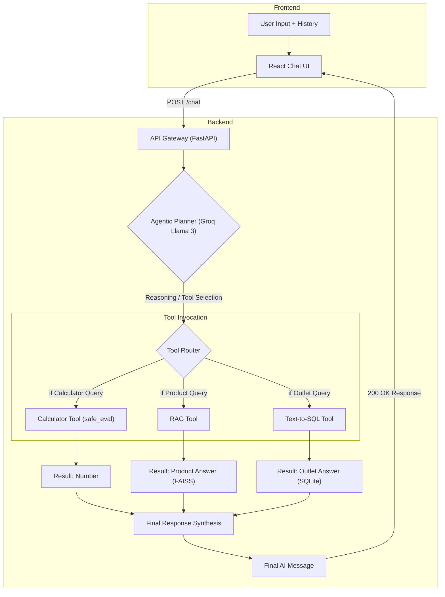
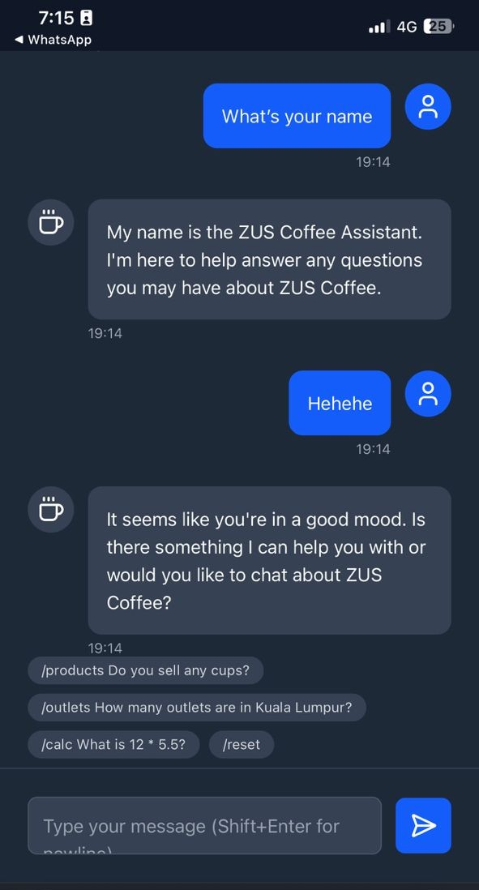
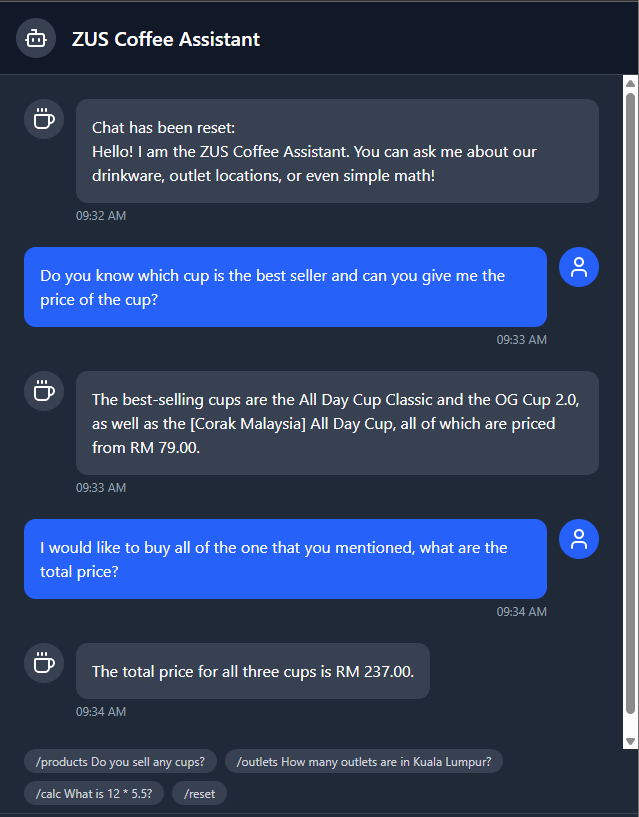

# 🧠 Mindhive AI Assistant Assessment

This repository contains the complete solution for the **Mindhive AI Software Engineer Assessment**, implementing a multi-turn, agentic chatbot that integrates **RAG**, **Text-to-SQL**, and a **Calculator Tool** using **FastAPI (Python)** for the backend and **React (Vite)** for the frontend.

---

## 0. Deployment Status & Live Links

The application is deployed as two decoupled services, enabling the full-stack architecture to function in a production environment.

| Service | Hosting Platform | Live URL |
|----------|------------------|-----------|
| Frontend (Chat UI) | Vercel | [https://zus-chatbot-tphk.vercel.app/](https://zus-chatbot-tphk.vercel.app/) |
| Backend (FastAPI Agent API) | Railway | [https://zuschatbot-production.up.railway.app/](https://zuschatbot-production.up.railway.app/) |

---

## 1. Architecture Overview (Parts 1–4)

The system follows a **modern, decoupled Microservices / Agentic architecture** built on four key layers:

### 🧩 A. The Agentic Planner (The “Brain” – `agent_core.py`)
- **Technology:** LangChain Agent Executor (`create_agent`) powered by **Groq (llama-3.3-70b-versatile)**
- **Memory (Part 1):** Maintained by passing the full `chat_history` (list of `AIMessage` / `HumanMessage` objects) to every invocation, allowing sequential conversations.
- **Action Selection (Part 2):** The LLM inspects user intent and decides which of the three internal tools to execute.

### ⚙️ B. Core Services (The “Tools”)

| Tool Name | Endpoint Type | Backend Technology | Data Source |
|------------|----------------|--------------------|--------------|
| calculator | Simple Function | Python `safe_eval` | N/A |
| zus_product_information | RAG Pipeline | LangChain LCEL, FAISS | ZUS Drinkware Data |
| zus_outlet_database | Text-to-SQL | LangChain SQL Agent | SQLite (`zus_outlets.db`) |

### 🌐 C. The API Gateway (`api_server.py`)
- **Technology:** FastAPI, served via Gunicorn and Uvicorn Worker.  
- **Function:** Exposes the unified `/chat` endpoint, serving as the single point of contact for the frontend.  
- **Startup:** Loads all core services (`rag_chain`, `sql_chain`, `agent_executor`) during the lifespan event.

### 💻 D. The Frontend (`frontend/src/App.jsx`)
- **Technology:** React (Vite), styled with TailwindCSS  
- **Function (Part 6):** Manages message history, handles user interaction, and communicates solely with the backend's `/chat` endpoint.
### 🚀 E. Request Flow


#### 🔑 Key Steps

1. **Frontend:** The user's input and the full chat history are sent to the single API endpoint.  
2. **API Gateway:** FastAPI receives the request and passes the history and message to the **Agentic Planner (Groq Llama 3)**.  
3. **Agentic Planner:** The LLM decides whether to respond directly or use one of the tools.  
4. **Tool Invocation:** The chosen tool (**Calculator**, **RAG**, or **SQL**) is called as a direct Python function, preventing network deadlocks.  
5. **Final Synthesis:** The tool's output is passed back to the **Groq Agent**, which formats the final, human-readable answer.
---

## 2. Setup and Installation Guide

### 🔧 Prerequisites
- Python 3.11
- Node.js & npm (for frontend)
- Groq API Key (set as environment variable)

### 🐍 Backend Installation

```bash
# Clone repository
git clone https://github.com/pkcktkksh98/zus_chatbot.git
cd zus_chatbot

# Set Python 3.11 environment (recommended version)
conda create -n mindhive python=3.11 -y
conda activate mindhive

# Install dependencies, including gunicorn and CPU-only torch
pip install -r requirements.txt
```

### 🔑 Set Environment Variables
Create a `.env` file in the root directory:

```env
GROQ_API_KEY="your_secret_groq_key_here"
```

### 🗂️ Data Ingestion Strategy (Part 4 – Products & Outlets)

To ensure the deployment is robust against anti-bot measures on the scraping target, the `zus_outlets.db` file is pre-built using the local environment and committed directly to the Git repository.

Generate Database Locally:

```bash
# Note: Database is generated in a subfolder and is included in the repo.
python backend/function/outlet_scraper.py
```

**RAG Index:** The FAISS vector store used for product RAG is built during the initial load of the `rag_service.py` module.

### 🌐 Frontend Installation

```bash
cd frontend
npm install
```

### ▶️ Running the Application Locally

This application requires two terminals running concurrently:

**Terminal 1 – Backend (using Gunicorn for production parity):**
```bash
python api\api_server.py
# Server: http://127.0.0.1:8000
```

**Terminal 2 – Frontend:**
```bash
cd frontend
npm run dev
# Frontend: http://localhost:5173
```

Access the Chat UI in your browser at **[http://localhost:5173](http://localhost:5173)**.

---

## 3. API Specification

The backend exposes four FastAPI endpoints:
- Three internal tool endpoints (used by the agent)
- One primary `/chat` endpoint for frontend

### 🗨️ 3.1 `/chat` Endpoint (Primary)

| Method | Path | Description |
|---------|------|-------------|
| POST | `/chat` | Receives user message + chat history, returns agent’s response |

**Request Body (JSON):**
```json
{
  "message": "What is the price of the all day cup?",
  "history": [
    {"type": "human", "content": "Hello"},
    {"type": "ai", "content": "Hello! How can I help?"}
  ]
}
```

**Response (200 OK):**
```json
{
  "answer": "The All Day Cup (500ml) is priced at RM 79.00."
}
```

### 🧰 3.2 Internal Tool Endpoints

| Method | Path | Description |
|---------|------|-------------|
| GET | `/products?query=<nl_query>` | RAG: Answer questions about ZUS drinkware via FAISS vector store |
| GET | `/outlets?query=<nl_query>` | Text-to-SQL: Query outlet locations using SQLite |
| GET | `/calculate?expression=<math_expr>` | Calculator: Perform simple math safely via `safe_eval` |

---

## 4. Live Demo Screenshots (Documentation)

This section provides a combined demonstration of the Agent’s core functionalities, showcasing its ability to reason across multiple tools — including database querying (Text-to-SQL), knowledge retrieval (RAG), and mathematical computation (Calculator).

**Purpose:**  
To prove that the Agent can intelligently identify user intent, select the appropriate tool, and generate accurate responses from various data sources.

**Example Combined Queries:**
1. *"How many outlets does ZUS have in Selangor?"* → Uses the **Text-to-SQL** tool to query structured data from the `/outlets` SQLite database.  
2. *"What are the features of the All Day Cup?"* → Utilizes the **RAG** tool (`/products`) to retrieve product information from the FAISS vector store.  
3. *"What is the result of 99 minus 3 times 5?"* → Invokes the **Calculator** tool (`/calculate`) to compute the mathematical expression.

These interactions collectively demonstrate the Agent’s ability to:
- Autonomously detect the correct tool based on query type.  
- Retrieve accurate information from both structured and unstructured sources.  
- Perform real-time reasoning and computation to return concise results.
- Response in a friendly manner.

**Screenshot Proof:**  
<p align="center">
  
  
  <!--  -->
<!-- </p>

 -->
<!--  -->

---


## 5. Key Design Decisions & Trade-offs

### 🚦 A. Deadlock Resolution (Performance & Stability)

| Challenge | Solution | Rationale |
|------------|-----------|------------|
| Server Deadlock (Part 2/4 Integration) | **Direct Invocation:** Changed agent tool functions to call `rag_chain.invoke(query)` directly instead of using HTTP requests. | Prevents single-threaded Uvicorn from freezing. Boosts speed and stability. |
| Model Brittleness | Used **llama-3.3-70b-versatile** and defined strict system prompts. | Smaller models hallucinated tools or entered recursion loops. The 70b model ensures reliability. |
| Deployment Stability | **Gunicorn/Uvicorn Worker:** Wrapped Uvicorn with Gunicorn for robust HTTP header parsing and improved resilience in containerized Railway environment. | Resolved persistent 400 Bad Request errors during CORS pre-flight checks. |

### 🧱 B. Robustness & Error Handling (Part 5)

- **SQL Injection Prevention:** Uses LangChain `create_sql_agent`, preventing malicious SQL.  
- **API Downtime Handling:** All tool calls wrapped in `try...except` blocks; gracefully handles Groq API errors or division-by-zero.  
- **Calculator Safety:** `/calculate` endpoint uses Python’s `ast` module to ensure only math expressions are executed.

### 🧭 C. Frontend Implementation (Part 6)

- **Framework Choice:** React/Vite chosen for modern web stack preference.  
- **Architecture:** Fully decoupled from Python-specific dependencies (no Streamlit/Gradio).  
- **State Management:** Chat history stored in `localStorage` for persistence across refreshes.

---

## 🏁 Summary

This project demonstrates an **end-to-end, production-ready AI Assistant architecture** with:

- ✅ Multi-turn conversational reasoning (memory)  
- ✅ Agent-based planning  
- ✅ RAG, Text-to-SQL, and Calculator tool integration  
- ✅ FastAPI backend + React (Vite) frontend  
- ✅ Optimized, high-resilience deployment  
